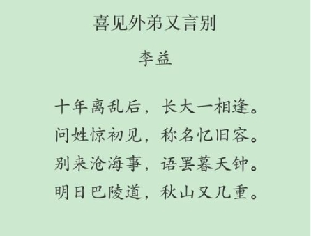
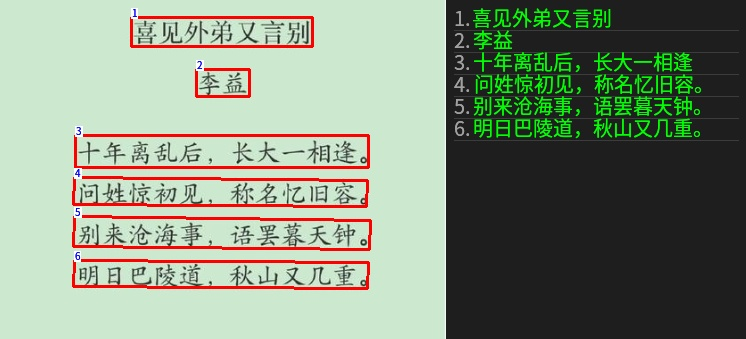
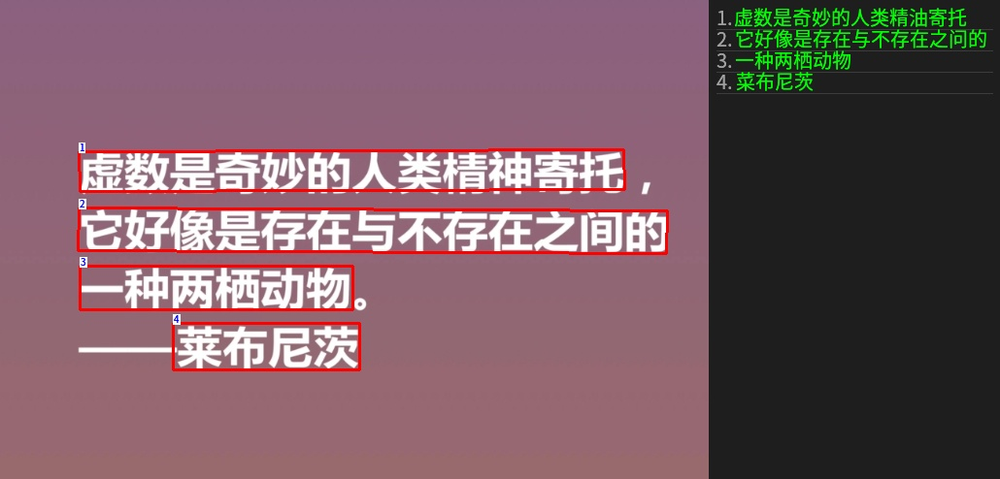
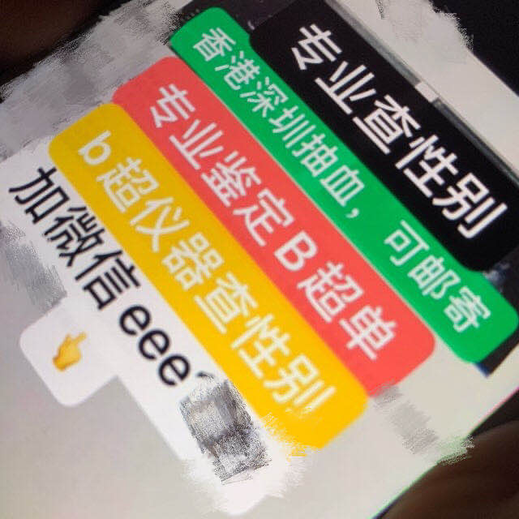
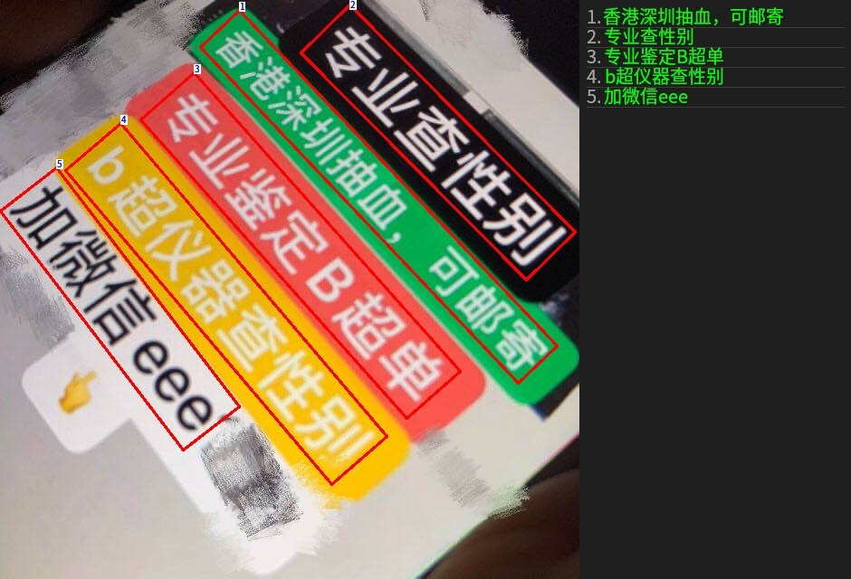

# chineseocr_lite_tensorRT

超轻量级中文 OCR，支持竖排文字识别，基于 [chineseocr_lite](https://github.com/DayBreak-u/chineseocr_lite) 移植至 **TensorRT 10.x**。

> **总模型仅 4.7M**：DBNet (1.8M) + CRNN (2.5M) + AngleNet (378KB)

---
## 写在前面
本项目是我对针对[chineseocr_lite](https://github.com/DayBreak-u/chineseocr_lite)该项目的TensorRT移植，因为我发现该项目发布好几年了，仍旧没有TensorRT的推理代码，因此我想尝试对其进行移植，顺便学习该项目进行OCR检测的基本流程及原理，于是便有了该仓库。本项目是基于[chineseocr_lite](https://github.com/DayBreak-u/chineseocr_lite)提供的`ncnn`版本移植进行修改的，且本项目已经尽可能让代码变得简洁直观（借助了claude code）。

---

## 效果展示

| 输入图片 | 识别结果 |
|---------|---------|
|  |  |
|  |  |
|  |  |


---

## 特性

- 超轻量：全部模型仅 **4.7M**，适合嵌入式/边缘设备部署
- 支持**竖排文字**识别
- 支持**倾斜文字框**检测与角度矫正
- 基于 **TensorRT 10.x** 加速推理，支持 FP16
- 已在 **Jetson NX (JetPack 6.x)** 上验证
- 可视化结果图：框 + 编号 + 右侧识别结果面板

---

## 模型结构

```
DBNet      文字检测    输入: [1, 3, H, W] 动态尺寸
AngleNet   方向分类    输入: [1, 3, 32, 192] 静态
CrnnNet    文字识别    输入: [1, 3, 32, W]  动态宽度
```

### 推理流程

```
输入图片
  └── DBNet 文字检测 → TextBox 列表
        └── 透视变换裁剪各文字区域
              └── AngleNet 方向分类 → 旋转矫正
                    └── CrnnNet 文字识别 → 最终文字结果
```

---

## 环境依赖

| 依赖 | 版本 |
|------|------|
| TensorRT | 10.7.0.23 |
| CUDA | 12.6.85 |
| OpenCV |4.10.0（含 freetype 模块）|
| CMake | ≥ 3.18 |
| C++ | 17 |

> 已在 **Jetson NX (compute 7.2 / JetPack 6.x)** 上测试通过。

---

## 项目结构

```
chineseocr_lite_tensorRT/
├── CMakeLists.txt
├── include/
│   ├── anglenet.h          # 方向分类网络
│   ├── crnn_net.h          # 文字识别网络
│   ├── dbnet.h             # 文字检测网络
│   ├── ocr_lite.h          # 三网络组合推理
│   ├── ocr_utils.h         # 工具函数
│   ├── ocr_struct.hpp      # 数据结构定义
│   ├── common.hpp          # TensorRT 公共工具
│   └── clipper.hpp         # 多边形膨胀算法
├── src/
│   ├── anglenet.cpp
│   ├── crnn_net.cpp
│   ├── dbnet.cpp
│   ├── ocr_lite.cpp
│   ├── ocr_utils.cpp
│   ├── clipper.cpp
│   └── main.cpp
└── weights/
    ├── dbnet.engine
    ├── angle_net.engine
    ├── crnn_lite_lstm.engine
    └── keys.txt
    └── NotoSansCJK-Regular.otf
```

---

## 编译

```bash
# 1. 克隆仓库
git clone https://github.com/zhahoi/chineseocr_lite_tensorRT.git
cd chineseocr_lite_tensorRT

# 2. 编译
mkdir build && cd build
cmake ..
make -j8
```

> 如需修改 CUDA 架构（默认 `72` for Jetson NX），编辑 `CMakeLists.txt` 中的 `CUDA_ARCHITECTURES`。

---

## 模型转换

使用 `trtexec` 将 ONNX 转换为 TensorRT 引擎：

```bash
cd weights

# DBNet（动态输入尺寸）
trtexec \
    --onnx=dbnet.onnx \
    --saveEngine=dbnet.engine \
    --fp16 \
    --memPoolSize=workspace:4096 \
    --minShapes=input0:1x3x32x32 \
    --optShapes=input0:1x3x736x736 \
    --maxShapes=input0:1x3x1024x1024 \
    --verbose

# AngleNet（静态输入，直接转换）
trtexec \
    --onnx=angle_net.onnx \
    --saveEngine=angle_net.engine \
    --fp16 \
    --memPoolSize=workspace:4096 \
    --verbose

# CrnnNet（动态宽度）
trtexec \
    --onnx=crnn_lite_lstm.onnx \
    --saveEngine=crnn_lite_lstm.engine \
    --fp16 \
    --memPoolSize=workspace:4096 \
    --minShapes=input:1x3x32x1 \
    --optShapes=input:1x3x32x480 \
    --maxShapes=input:1x3x32x2000 \
    --verbose 2>&1 | grep -E "output|Output|out|shape|Shape" | head -30
```

---

## 使用方法

### 基本用法

```bash
./chineseocr_lite \
    -d /path/to/weights \
    -i /path/to/image.jpg
```

### 完整参数

```bash
./chineseocr_lite \
    -d  <模型目录>              # 必填：weights 目录路径
    -i  <图片路径>              # 必填：输入图片
    -1  <dbnet引擎文件名>       # 默认: dbnet.engine
    -2  <anglenet引擎文件名>    # 默认: angle_net.engine
    -3  <crnnnet引擎文件名>     # 默认: crnn_lite_lstm.engine
    -4  <keys文件名>            # 默认: keys.txt
    -f  <字体文件名>            # 默认: NotoSansCJK-Regular.ttc（结果图中文渲染）
    -p  <padding>               # 默认: 50
    -s  <maxSideLen>            # 默认: 1024
    -b  <boxScoreThresh>        # 默认: 0.6
    -o  <boxThresh>             # 默认: 0.3
    -u  <unClipRatio>           # 默认: 2.0
    -a  <doAngle 0/1>           # 默认: 1（开启方向检测）
    -A  <mostAngle 0/1>         # 默认: 1（开启投票统一方向）
```

### 示例

```bash
# 使用默认参数
./chineseocr_lite -d ./weights -i ./images/test.png

# 指定字体，生成带文字标注的结果图
./chineseocr_lite \
    -d ./weights \
    -i ./images/test.png \
    -f NotoSansCJK-Regular.ttc

# 关闭方向检测（速度更快）
./chineseocr_lite -d ./weights -i ./images/test.png -a 0 -A 0
```

### 输出文件

| 文件 | 说明 |
|------|------|
| `<图片名>-result.txt` | 识别文字结果 |
| `<图片名>-result.jpg` | 可视化标注图（框 + 编号 + 右侧面板）|

---

## 参数调优建议

| 参数 | 说明 | 推荐值 |
|------|------|--------|
| `padding` | 图像四周白边，有助于边缘文字检测 | 50 |
| `maxSideLen` | 最长边限制，影响检测精度和速度 | 1024 |
| `boxScoreThresh` | 文字框置信度阈值，越高漏检越多 | 0.5~0.7 |
| `boxThresh` | DBNet 二值化阈值 | 0.3 |
| `unClipRatio` | 文字框膨胀比例，越大框越宽松 | 1.8~2.2 |

---

## 致谢

- [chineseocr_lite](https://github.com/DayBreak-u/chineseocr_lite)

---

## License

MIT License